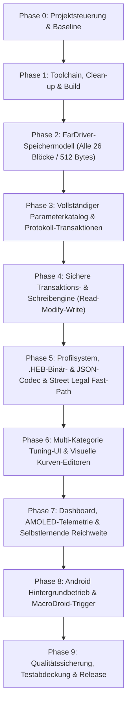

# ArcDash Entwicklungsroadmap (Überarbeitet: Vollständige Parameter- & Tuning-Integration)

Diese Datei ist die zentrale Source of Truth für die Entwicklung von ArcDash.
Mit der vollständigen Analyse des FarDriver-Protokolls und des Snapshots ([`reference/controller_snapshot.md`](../reference/controller_snapshot.md)) deckt ArcDash das gesamte Spektrum aller 100+ Controller-Parameter, 26 Speicherblöcke, interaktiven Drehzahl-/Rekuperations-Kurven, Pin-Mappings und des .HEB-Backup-Systems ab.

## Status-Legende

- `[ ]` offen
- `[~]` in Arbeit
- `[x]` abgeschlossen
- `[!]` blockiert

---

## Phasenübersicht

---

## Phase 0: Projektsteuerung & Baseline
- [x] **T001** Anforderungs-Traceability erstellen (`5b739c5`)
- [x] **T002** Hardware- und Produktentscheidungen erfassen (`ec2db1c`)
- [x] **T003** Reproduzierbaren Ist-Zustand dokumentieren (`87a0202`)

## Phase 1: Grundlage und Build
- [x] **T004** Flutter-, Dart-, Docker- und Android-Versionen festlegen (`8aad3e5`)
- [x] **T005** Android-Gradle-Konfiguration reparieren (`b1be29e`)
- [x] **T006** BikeTunes vollständig zu ArcDash umbenennen (`496858f`)
- [x] **T007** Abhängigkeiten und Lints bereinigen (`251b0f2`)
- [x] **T008** Build- und Test-Baseline stabilisieren (`0e4b1a6`)

## Phase 2: FarDriver-Speichermodell & Protokoll-Mapping (Vollständige Abdeckung)
- [x] **T009** Protokoll-Belegmatrix für alle 26 Blöcke (0x00..0xD0 + 0xD6..0xFA) erstellen ([Details](./02-protokoll-und-parameter.md#t009---protokoll-belegmatrix-erstellen))
- [x] **T010** BLE-Captures und Paket-Fixtures definieren (`0ad9ecf`)
- [x] **T011** CRC durch Golden-Tests absichern (`9434f27`)
- [x] **T012** Fragmentierungsfesten Paket-Framer bauen (`6a95ff0`)
- [x] **T013** Vollständiges 26-Block FarDriver-Speichermodell (`fardriver_memory.dart`) abbilden ([Details](./02-protokoll-und-parameter.md#t013---fardriver-speichermodell-abbilden))
- [x] **T014** Telemetrie-, Fehler- und Safety-Register decodieren (`981f044`)
- [x] **T015** Parameter-Snapshots aus dem rotierenden Datenstrom aggregieren (`fb080b1`)
- [x] **T016** FarDriver-Schreibkommandos (Einzelwort `0x46`, Block `0xC0+len`, Bulk `0xFE`, Save/Reset `0xA0`) typisieren ([Details](./02-protokoll-und-parameter.md#t016---schreibprotokoll-ack-und-heb-validieren))

## Phase 3: BLE & Controller-Session
- [x] **T017** Testbare Transport-Schnittstelle einführen (`746623d`)
- [x] **T018** Zustandsbehaftete Controller-Session bauen (`8be4515`)
- [x] **T019** Android-Runtime-Permissions implementieren (`dbc21d5`)
- [x] **T020** Scan, Pairing und Service-Erkennung härten (`164dbd4`)
- [x] **T021** Automatisches Wiederverbinden implementieren (`b8ef6d7`)
- [x] **T022** Command-Queue und Protokollzugriff serialisieren (`ab63b52`)
- [x] **T023** Diagnose-Logging und Export ergänzen (`8fea1a8`)

## Phase 4: Parameterkatalog & Sichere Schreibengine
- [x] **T030** Umfassenden 100+-Parameterkatalog mit Hardwaregrenzen und Risikoklassen definieren ([Details](./05-sichere-schreibengine.md#t030---parameterkatalog-und-hardwaregrenzen-erstellen))
- [x] **T031** Fail-closed Safety-Evaluator (Stillstand `0.0 km/h`, Frische, Fehlerfrei) absichern ([Details](./05-sichere-schreibengine.md#t031---fail-closed-safety-evaluator-bauen))
- [x] **T032** Read-Modify-Write Engine für Bitfelder und Wort-Updates implementieren ([Details](./05-sichere-schreibengine.md#t033---diff-und-read-modify-write-implementieren))
- [x] **T033** Transaktionales Schreiben mit ACK-Prüfung und Read-Back-Verifikation bauen ([Details](./05-sichere-schreibengine.md#t034---transaktionales-schreiben-mit-read-back-bauen))
- [x] **T034** Rollback-Planung bei Teilabbrüchen und Write-Locking implementieren ([Details](./05-sichere-schreibengine.md#t035---teilfehler-und-rollback-behandeln))
- [x] **T035** FarDriver Save- & Reboot-Kommandoablauf (`0xA0 / 0x88 0x05 / 0x01`) integrieren ([Details](./05-sichere-schreibengine.md#t036---write-lock-idempotenz-und-audit-log-ergaenzen))

## Phase 5: Profil- & Backup-System (.HEB & JSON)
- [x] **T038** Versioniertes Profilmodell für vollständige Parameterkonfigurationen definieren ([Details](./06-profilsystem.md#t038---versioniertes-profilmodell-implementieren))
- [x] **T039** Integrierte Presets definieren (`Stock Offroad`, `Eco Range`, `Street Legal`, `Trail`, `Extreme Sport`) ([Details](./06-profilsystem.md#t039---integrierte-profile-definieren))
- [x] **T040** Profilverwaltung (CRUD, Duplizieren, Diff-Ansicht) bereitstellen ([Details](./06-profilsystem.md#t040---profilverwaltung-implementieren))
- [x] **T041** Vollwertigen .HEB-Binär-Parser und -Generator (696 Bytes) implementieren ([Details](./06-profilsystem.md#t043---json-import-und--export-implementieren))
- [x] **T042** Atomaren Werks-Restore aus `unmodified_basemap.heb` unterstützen ([Details](./06-profilsystem.md#t044---profile-verifiziert-anwenden))
- [x] **T043** Street-Legal-Fast-Path für sekundenschnellen, minimalen Diff-Schreibvorgang optimieren ([Details](./06-profilsystem.md#t045---street-legal-fast-path-optimieren))

## Phase 6: Multi-Kategorie Tuning-UI & Visuelle Editoren
- [x] **T086** 4-Tab-Hauptnavigation (`Cockpit`, `Tuning`, `Fahrten`, `Einstellungen`) etablieren
- [x] **T087** TuningScreen als modulares Haupt-Cockpit für Parameter aufbauen
- [x] **T096** Quick-Tuning Bar für Alltags-Fahrer (Fahrmodi, Speed, Strom, Response) bereitstellen
- [x] **T097** 10-Kategorien Parameter-Matrix (Motor, Ratios, Regen, Pins, CAN/Display, Protect, PID, Flags, Fixed) implementieren
- [x] **T098** Interaktiven 18-Punkte-Drehzahlkurven-Editor (500–9000 RPM) mit Kurvengraph bauen
- [x] **T099** Interaktiven Rekuperationskurven-Editor (500–9000 RPM) bauen
- [x] **T100** Pin- & Hardware-Funktions-Manager (interaktive Pin-Zuordnung 1..24/NC) bereitstellen
- [x] **T101** Expert-Mode Guardrails & Vorher-Nachher Diff-Dialog integrieren

## Phase 7: Dashboard, Telemetrie & Lernende Reichweite
- [x] **T054** App-Shell, AMOLED-Designsystem und Navigation implementieren
- [x] **T055** Telemetriequalität und Stale-State-Erkennung fertigstellen
- [x] **T056** GPS-Geschwindigkeit mit Controller-RPM Fallback absichern
- [x] **T057** Konfigurierbaren Dashboard-Renderer für Hoch- und Querformat bauen
- [x] **T061** Selbstlernende Reichweitenprognose (Coulomb-Counting, SOC-Filter, Fahrstil-Fenster) implementieren
- [x] **T070** Session-Lifecycle, Statistiken und Fehlerhistorie persistieren

## Phase 8: Android Hintergrundbetrieb & MacroDroid
- [x] **T046** Foreground-Service-Architektur festlegen
- [x] **T047** Android-Service und Hintergrundberechtigungen konfigurieren
- [x] **T048** BLE-Session nahtlos im Hintergrundbetrieb aufrechterhalten
- [x] **T049** MacroDroid-Intent-Empfänger für Volume-Down Doppelklick bereitstellen
- [x] **T050** Street Legal Profil bei ausgeschaltetem Bildschirm anwenden mit Vibrations-Feedback

## Phase 9: Qualitätssicherung & Release
- [x] **T076** Kernmodule auf hohe Testabdeckung bringen
- [x] **T077** Widget-, Golden- und Unit-Tests erweitern
- [x] **T094** Umfassende Testsuite für alle 26 Blöcke, 100+ Parameter, HEB-Codec und Kurven-Editoren erweitern
- [ ] **T095** Release v2.0.0 via GitHub Actions erstellen und APK verifizieren
